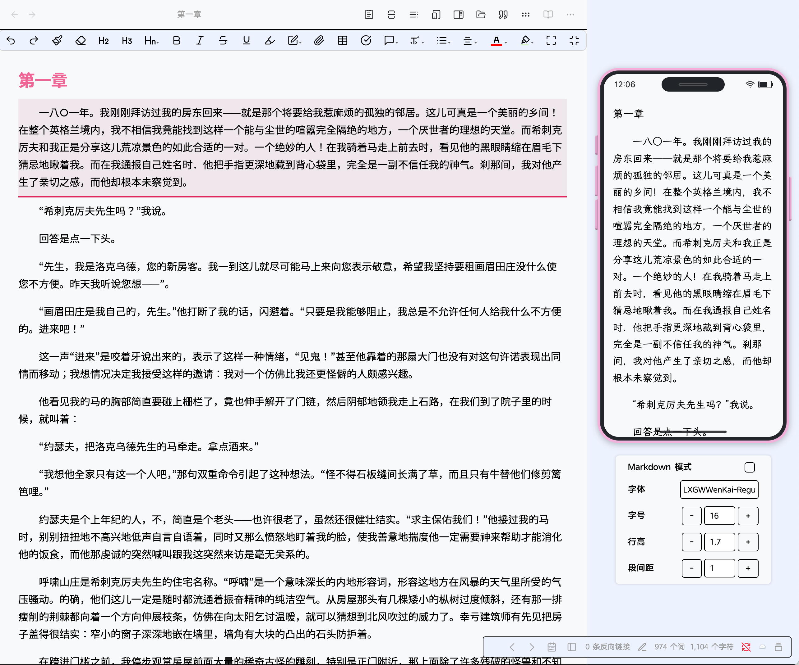
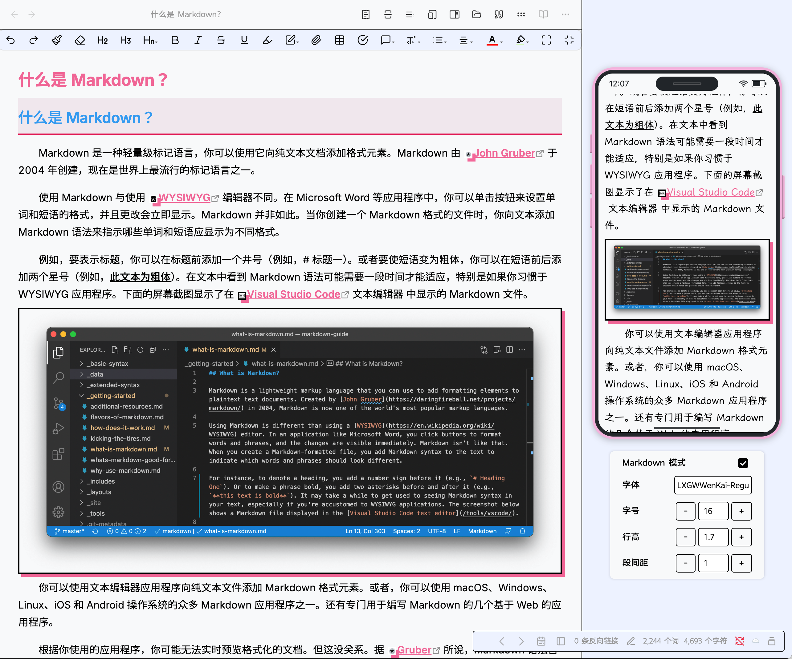
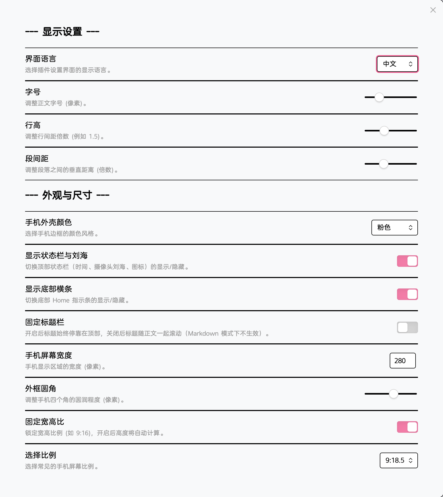
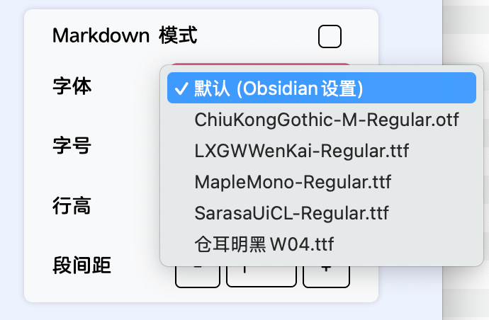

## 功能 ：
- **手机版界面实时阅读：**
	- 可切换**小说阅读**模式和**Markdown 文档阅读**模式。
	- 可自定义字号、行距和段落间距。
	- 切换阅读字体（字体文件需要放置在插件目录下的 fonts 文件夹内）。
- **定位编辑：** 在手机界面中单击文本，光标将自动定位到编辑器中的对应段落。
- **段落编辑提示：** 编辑段落时，手机界面会自动滚动并高亮显示。

## 安装方法：
- [下载](https://github.com/hailey07/obsidian-novel-mobile-view/releases/download/V1.1.1/obsidian-novel-mobile-view.zip)并解压文件。
- 将 **obsidian-novel-mobile-view** 文件夹放入 **第三方插件** 文件夹（设置 → 第三方插件 → 已安装插件 → 打开插件文件夹图标）。

## 界面预览：

