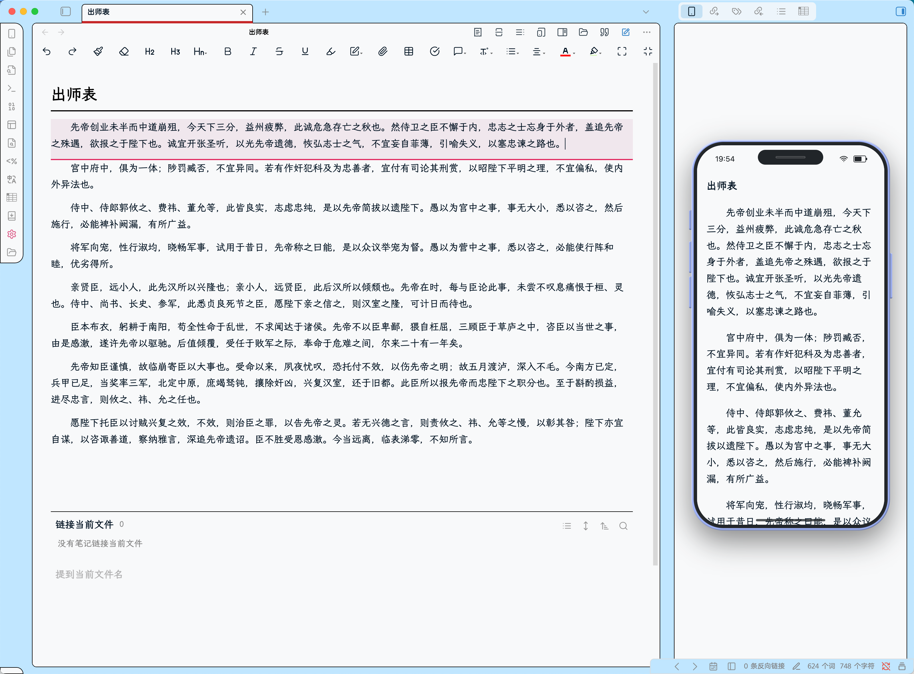

## 功能：
* **沉浸式阅读：** 将笔记内容以手机端阅读形式展示（**仅支持纯文本展示**）。
	* 可自定义字号、行间距、段间距
	* 可变更为浮动窗口
* **定位编辑：** 在预览窗口可点击文字，自动将光标定位至待修改段落。
* **编辑段落提示：** 编辑段落会自动滚动在预览窗口进行高亮提示。

## 截图：

## 兼容性
本插件需要 Obsidian v0.15.0 或更高版本。

