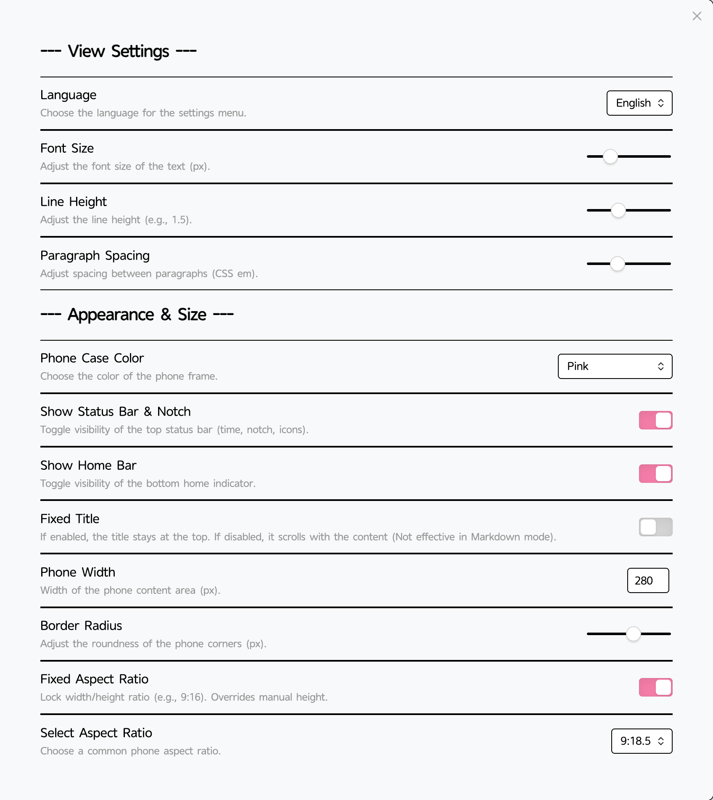

[📚**中文介绍**](CNReadme.md)

## Features:
- **Real-time reading on mobile:**
- Switch between **novel reading** and **Markdown document reading** modes.
- Customizable font size, line spacing, and paragraph spacing.
- Switch reading font (font files need to be placed in the fonts folder under the plugin directory).
- **Positioning editing:** Clicking on text on the mobile interface will automatically position the cursor in the corresponding paragraph in the editor.
- **Paragraph editing tips:** When editing paragraphs, the mobile interface will automatically scroll and highlight them.

## Installation:
- [Download](https://github.com/hailey07/obsidian-novel-mobile-view/releases/download/V1.1.1/obsidian-novel-mobile-view.zip) and extract the file . 
- Place the ``obsidian-novel-mobile-view`` folder into ``Community plugins`` folder (``Setting → Community plugins → Installed plugins → Open plugins folder icon``).

## Interface Preview:

